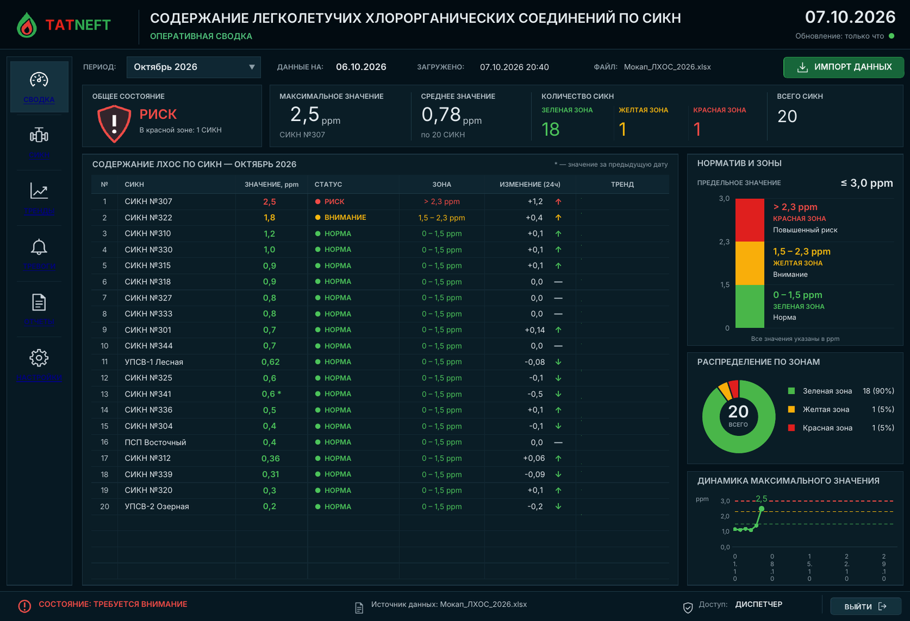

# Дашборд «Содержание ЛХОС по СИКН» в Excel

Оперативная сводка по содержанию легколетучих хлорорганических соединений (ЛХОС)
на СИКН. Это книга Excel с макросами (`.xlsm`) в тёмном стиле макета. Данные
загружаются кнопкой **«Импорт данных»** из файла исходного формата: на каждый
месяц отдельный лист.



*Превью отрисовано LibreOffice после импорта мокап-файла. В Excel в столбце
«Тренд» рисуются спарклайны, пункты меню слева не подчёркиваются, а подписи
дат под графиком идут в одну строку.*

## Файлы

| Файл | Что это |
|---|---|
| `dist/Дашборд_ЛХОС.xlsm` | Дашборд. Пустой, данные загружаются импортом |
| `dist/Мокап_ЛХОС_2026.xlsx` | Пример исходных данных: выдуманные СИКН, январь – 06.10.2026 |
| `dist/Мокап_ЛХОС_2026_дополнение.xlsx` | Тот же файл плюс 07.10.2026, новый объект «СИКН №350» и одно изменённое старое значение. Нужен для проверки режима «добавить только новые» |

## Быстрый старт

1. Скачайте `Дашборд_ЛХОС.xlsm`. Если Excel пишет «Майкрософт заблокировал
   макросы…», откройте свойства файла и отметьте **«Разблокировать»**, или
   положите файл в доверенное расположение. Затем откройте книгу и нажмите
   **«Включить содержимое»**.
2. Нажмите **«Импорт данных»** и выберите `Мокап_ЛХОС_2026.xlsx`. При первом
   импорте база заполняется целиком, без вопросов.
3. Ещё раз нажмите **«Импорт данных»** и выберите
   `Мокап_ЛХОС_2026_дополнение.xlsx`. Программа спросит, как загружать:
   - **Да** — загрузить все данные заново (старые данные удаляются);
   - **Нет** — добавить только новые значения (имеющиеся не меняются);
   - **Отмена** — ничего не загружать.

   В режиме «Нет» добавятся 07.10 и СИКН №350. В отчёте будет одно расхождение:
   значение СИКН №301 за 03.10 в файле отличается от базы, и в базе остаётся
   старое значение.

## Что показывает сводка

- **Период** (выпадающий список вверху; можно щёлкнуть и по стрелке ▼). В списке
  месяцы, за которые есть данные. При открытии книги выбирается текущий месяц, а
  если за него данных ещё нет, то последний месяц с данными.
  - **Текущий месяц.** Для каждого СИКН берётся значение на сегодня. Если его ещё
    нет, берётся последнее значение до сегодняшней даты: за вчера или раньше в
    этом месяце. Первого числа, пока за новый месяц нет данных, показывается
    значение за последний день прошлого месяца.
  - **Прошлый месяц.** Последнее значение СИКН в этом месяце.
  - Если значение СИКН взято за более раннюю дату, чем у остальных, рядом с
    числом стоит звёздочка `*`.
- **Справа вверху** — текущая дата и время с последней загрузки
  («Обновление: 5 мин назад»). Индикатор рядом: зелёный, если загрузка была
  меньше суток назад, жёлтый — до 3 суток, красный — дольше.
- **Карточки сверху:**
  - общее состояние (норма / внимание / риск / превышение норматива);
  - максимальное значение и на каком СИКН оно получено;
  - среднее значение;
  - количество СИКН по зонам и общее число СИКН.
- **Таблица.** СИКН отсортированы по убыванию значения. Для каждого показаны
  статус, зона, изменение за 24 ч (разница с предыдущим замером) и тренд за
  выбранный месяц. Зона определяется по значению, округлённому до 2 знаков, как
  на экране.
- **Справа:** норматив и границы зон, распределение СИКН по зонам, график
  максимального за день значения за выбранный месяц.

Границы зон по умолчанию:

| Зона | Значение |
|---|---|
| Зелёная | 0 – 1,5 ppm |
| Жёлтая | 1,5 – 2,3 ppm |
| Красная | выше 2,3 ppm |
| Норматив | ≤ 3,0 ppm |

Значения выше норматива получают статус «ПРЕВЫШЕНИЕ». Границы меняются на
вкладке **«Настройки»**, сводка пересчитывается сразу.

## Навигация

Меню слева переключает вкладки: **Сводка, СИКН, Тренды, Тревоги, Отчёты,
Настройки**. Работают «Сводка» и «Настройки». Остальные разделы пока заглушки:
навигация на них уже настроена, функциональность будет добавлена.

На вкладке «Настройки»:

- пороги зон (порядок проверяется: зелёная < жёлтая ≤ норматив);
- подписи (заголовок, подзаголовок, роль доступа);
- сведения о базе;
- кнопки «Импорт данных» и «Очистить базу»;
- журнал последних 50 загрузок.

## Формат исходного файла

Как в присланном шаблоне. На каждый месяц отдельный лист с любым названием.

- На листе есть ячейка **«Дата»** (в шаблоне это объединённые B4:B5). Под ней
  идут даты, по одной строке на день.
- В нижней строке заголовка (строка 5) — **наименования объектов**. Строкой
  выше (строка 4) — вид продукции.
- Значения в ppm. Пустая ячейка означает, что данных нет. Значения вида `0,45`
  в текстовом формате тоже читаются, нечисловые (`н/д`) пропускаются.
- Листы без ячейки «Дата» (например, «Свод») игнорируются. Пустые листы
  будущих месяцев не мешают.
- Объекты сопоставляются по наименованию, порядок столбцов в разных месяцах
  может отличаться. Новые объекты добавляются в базу автоматически.
- Итоговые столбцы и строки («Среднее», «Итого» и т. п.) не считаются объектами
  и датами. Строки, скрытые фильтром, тоже загружаются.
- Если одна и та же дата встречается на разных листах (например, скопировали
  лист и не поменяли даты), берётся последний лист, а в отчёте об импорте
  появится предупреждение.

После импорта показывается отчёт: сколько значений загружено или добавлено,
сколько уже было в базе, какие значения расходятся с базой, какие появились
новые объекты. Книга сразу сохраняется, чтобы база не потерялась. Журнал
загрузок ведётся на вкладке «Настройки».

## Как устроено

- Все показатели считаются **формулами Excel** по листу «БД». Расчёты лежат на
  скрытом листе «Расчет». Сводка пересчитывается без макросов, например при
  смене месяца или порогов.
- **Макросы VBA** нужны для импорта файла, обновления надписи о времени
  загрузки (раз в минуту), переключения значка состояния, кнопок и подгонки
  масштаба сводки под размер окна.
- База рассчитана примерно на 10 лет ежедневных данных. Расчёты охватывают до
  40 объектов, в таблице сводки 24 строки.
- Книга не использует функции Excel 365 и должна работать в Excel 2010 и новее
  (Windows). Тренды в таблице — спарклайны Excel.

## Сборка из исходников

Книга генерируется скриптом на Python. Excel для сборки не нужен.

```bash
pip install xlsxwriter openpyxl pillow
python3 build.py          # пересобирает dist/
```

| Путь | Что там |
|---|---|
| `src/vba/` | исходный код макросов (`modImport.bas` — импорт, `modApp.bas` — служебные процедуры, `ThisWorkbook.cls`, модули листов) |
| `src/lhos/dashboard.py` | разметка листов, формулы, графики |
| `src/lhos/vbaproject.py` | сборка `vbaProject.bin` из исходников VBA (форматы MS-OVBA/MS-CFB) |
| `src/lhos/mockdata.py` | генератор мокап-данных |
| `src/lhos/icons.py`, `src/lhos/buttons.py` | иконки и кнопки |
| `tests/` | проверки; сквозные тесты гоняют импорт в LibreOffice |

Если макросы в книге по какой-то причине не загрузились, модули из `src/vba/`
можно импортировать вручную: Alt+F11 → File → Import File.

### Проверки

```bash
python3 -I tests/test_vbaproject.py   # формат vbaProject.bin, сверка с эталонным файлом Excel
python3 -I tests/test_build.py        # проект VBA компилируется, ряды диаграмм числовые
python3 -I tests/test_integration.py  # сквозной тест в LibreOffice (около 4 минут)
python3 -I tests/test_mockdata.py
python3 -I tests/test_icons.py
python3 -I tests/test_vba_lo.py
```

Сквозной тест открывает книгу в LibreOffice и выполняет импорт макросом во всех
режимах. Затем он сверяет каждую цифру и надпись сводки с независимым расчётом
на Python (`tests/oracle.py`) для разных месяцев, порогов и «сегодняшних» дат:
больше 21 000 проверок. Excel при разработке не запускался, поэтому
формат VBA-проекта дополнительно сверен с эталонным файлом, сохранённым Excel.
